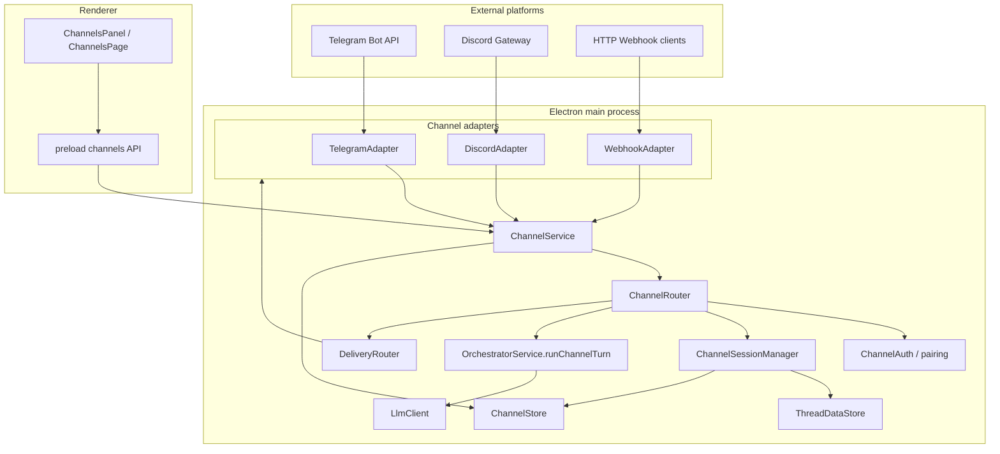

# Mousse Channels — Implementation Plan

## Executive Summary

### What Hermes channels do

Hermes **Gateway** connects the AI agent to external messaging platforms (Telegram, Discord, Slack, WhatsApp, Signal, Matrix, Feishu, WeChat, iMessage/BlueBubbles, QQ, email, SMS, webhook, and plugin platforms). Remote users send messages from those apps; the agent replies in-thread with full session continuity.

Core Hermes patterns (from `tmp/hermes-agent/gateway/`):

| Concern | Hermes implementation |
|---------|-------------------------|
| **Platform adapters** | `BasePlatformAdapter` in `gateway/platforms/base.py` — connect, disconnect, send, receive, typing, media |
| **Registry** | `platform_registry.py` — plugin/built-in adapter discovery and factory |
| **Sessions** | `session.py` — `SessionSource` (platform, chat_id, user, thread), persistent `sessions.json`, reset policies |
| **Message routing** | `run.py` GatewayRunner — inbound `MessageEvent` → auth → session key → agent turn → outbound via adapter |
| **Delivery** | `delivery.py` — `DeliveryTarget.parse("telegram:123")`, cron output routing, truncation/chunking |
| **Channel directory** | `channel_directory.py` — cached map of reachable chats for `send_message` tool |
| **Auth** | `pairing.py` — DM pairing codes; env allowlists (`TELEGRAM_ALLOWED_USERS`, etc.) |
| **Relay** | `relay/` — experimental generic adapter for hosted connector (multi-platform over WebSocket) |

Supported built-in platforms (from `gateway/config.py` `Platform` enum): Telegram, Discord, WhatsApp (Baileys + Cloud API), Slack, Signal, Mattermost, Matrix, Home Assistant, Email, SMS, DingTalk, Feishu, WeCom, Weixin, BlueBubbles, QQ Bot, Yuanbao, Webhook, API server, MS Graph webhook, Relay.

### What Mousse needs

Mousse is an **Electron desktop orchestrator** with threads, projects, and an in-app orchestrator chat. Channels add **remote control**: message the agent from Telegram/Discord (etc.) and get replies without opening the desktop app.

Mousse adaptation constraints:

- **Process model**: single main process (not Python asyncio gateway); adapters run as Node services in main.
- **Persistence**: `~/.mousse/` (see `ScheduledJobStore`, `ThreadDataStore`) instead of `~/.hermes/`.
- **Conversation state**: map each `(platform, chatId[, threadId])` → **Mousse thread** so history survives restarts and appears in the UI.
- **Orchestrator**: reuse `LlmClient` / thread message store; channel turns run **isolated** from the active UI thread (no `ThreadContext.switchThread` disruption).
- **Scope v1**: Telegram + Discord + inbound Webhook; extensible adapter interface for future platforms.

---

## Architecture



### Inbound message flow

1. Adapter receives platform message → normalizes to `InboundChannelMessage`.
2. `ChannelRouter` checks `ChannelAuth` (allowlist / pairing / allow-all).
3. `ChannelSessionManager.resolveSession()` → thread id (create thread if new).
4. `OrchestratorService.runChannelTurn(threadId, text)` — load thread history, LLM turn, save, return assistant text.
5. `DeliveryRouter.deliver()` chunks text and sends via originating adapter.
6. Optional: broadcast `channels:inbound` / `channels:outbound` for UI activity log.

### Outbound / cron delivery (future hook)

Scheduled jobs can gain `deliver: "telegram"` later using the same `DeliveryRouter` Hermes-style target strings.

---

## File Structure

```
src/
  shared/types.ts                          # Channel types (extend)
  main/
    data/paths.ts                          # getChannelsDir(), etc.
    channels/
      types.ts                             # Adapter interfaces, internal events
      ChannelStore.ts                      # configs, sessions, directory, pairing
      ChannelSessionManager.ts             # session key → threadId
      ChannelAuth.ts                       # allowlist + pairing codes
      ChannelRouter.ts                     # inbound dispatch + turn queue
      ChannelService.ts                    # lifecycle, adapter registry
      delivery.ts                          # DeliveryTarget parse + send
      chunkMessage.ts                      # platform message splitting
      adapters/
        BaseChannelAdapter.ts
        TelegramAdapter.ts
        DiscordAdapter.ts
        WebhookAdapter.ts
    orchestrator/OrchestratorService.ts    # runChannelTurn()
    ipc/registerIpc.ts                       # channels:* handlers
    index.ts                               # bootstrap ChannelService
  preload/index.ts                         # window.mousse.channels
  renderer/
    components/ChannelsPage.tsx
    components/ChannelsPanel.tsx
    styles/channels-panel.css
    stores/appStore.ts                     # channelsOpen
    main.tsx                               # mount ChannelsPage
tests/channels.test.ts
channels-plan.md                           # this file
```

---

## Type Definitions (`src/shared/types.ts`)

```typescript
export type ChannelPlatform = 'telegram' | 'discord' | 'webhook'

export type ChannelConnectionState = 'disconnected' | 'connecting' | 'connected' | 'error'

export interface ChannelPlatformConfig {
  enabled: boolean
  token?: string           // bot token (Telegram / Discord)
  allowedUserIds?: string[]
  allowAllUsers?: boolean
  homeChatId?: string      // default outbound target
  webhookPort?: number     // webhook adapter
  webhookSecret?: string
}

export interface ChannelConfig {
  platforms: Record<ChannelPlatform, ChannelPlatformConfig>
  filterSilenceNarration: boolean
  unauthorizedDmBehavior: 'pair' | 'ignore'
}

export interface ChannelSession {
  sessionKey: string       // e.g. "telegram:12345" or "discord:987:thread456"
  platform: ChannelPlatform
  chatId: string
  threadId?: string
  chatName?: string
  userId?: string
  userName?: string
  chatType: 'dm' | 'group' | 'channel' | 'thread'
  threadId_mousse: string  // linked Mousse thread UUID
  lastMessageAt?: string
  createdAt: string
}

export interface ChannelDirectoryEntry {
  id: string
  name: string
  type?: string
  guild?: string
  threadId?: string
}

export interface ChannelStatus {
  platform: ChannelPlatform
  state: ChannelConnectionState
  error?: string
  connectedAt?: string
}

export interface ChannelsSnapshot {
  config: ChannelConfig
  sessions: ChannelSession[]
  statuses: ChannelStatus[]
  directoryUpdatedAt?: string
}

export interface PairingRequest {
  code: string
  platform: ChannelPlatform
  userId: string
  userName?: string
  createdAt: string
  expiresAt: string
}

export interface ChannelActivityEvent {
  id: string
  direction: 'inbound' | 'outbound'
  platform: ChannelPlatform
  sessionKey: string
  text: string
  timestamp: string
}
```

---

## Main Process Services

### `BaseChannelAdapter`

Abstract interface mirroring Hermes `BasePlatformAdapter` (minimal subset):

- `platform: ChannelPlatform`
- `connect(config): Promise<void>`
- `disconnect(): Promise<void>`
- `getStatus(): ChannelStatus`
- `onMessage(handler: (msg: InboundChannelMessage) => void)`
- `send(target: OutboundChannelMessage): Promise<SendResult>`
- `sendTyping?(chatId: string, threadId?: string): Promise<void>`

### `ChannelService`

- Loads/saves config via `ChannelStore`
- Instantiates enabled adapters on `start()`
- Registers inbound handler → `ChannelRouter.handleInbound`
- Exposes CRUD for config, pairing approve/reject, connect/disconnect
- Rebuilds channel directory periodically (session-derived entries)

### `ChannelRouter`

- Per-session promise queue (prevent concurrent turns on same chat)
- Global concurrency limit (1 active LLM turn across channels initially — avoids orchestrator singleton races)
- Calls `orchestrator.runChannelTurn`
- Filters silence narration (Hermes `delivery.py` pattern)
- Emits activity events

### `ChannelSessionManager`

- `buildSessionKey(platform, chatId, threadId?)`
- `resolveThread(session)` — lookup or create thread named `"Telegram: {chatName}"` etc.
- Persists sessions in `~/.mousse/channels/sessions.json`

### `ChannelAuth`

- Env-style allowlists in config (`allowedUserIds`, `allowAllUsers`)
- Pairing: 8-char codes, 1h TTL, max 3 pending per platform (port of Hermes `pairing.py` semantics)
- Unauthorized DM: `pair` (send code) or `ignore`

### `DeliveryRouter`

- Parse targets: `origin`, `local`, `telegram`, `telegram:12345`, `discord:guild/channel`
- Chunk messages (`chunkMessage.ts`) — Telegram 4096 UTF-16 aware simplified to 4000 char chunks

---

## IPC Handlers

| Channel | Purpose |
|---------|---------|
| `channels:getSnapshot` | Full status for UI |
| `channels:getConfig` | Config only |
| `channels:updateConfig` | Patch platform settings |
| `channels:connect` | Start adapter(s) |
| `channels:disconnect` | Stop adapter(s) |
| `channels:listSessions` | Active channel sessions |
| `channels:listPairingRequests` | Pending pairing codes |
| `channels:approvePairing` | Approve user by code |
| `channels:rejectPairing` | Reject code |
| `channels:sendTest` | Manual outbound test message |
| `channels:updated` | Broadcast snapshot changes |
| `channels:activity` | Broadcast inbound/outbound log events |

---

## Preload API

```typescript
channels: {
  getSnapshot(): Promise<ChannelsSnapshot>
  updateConfig(patch: Partial<ChannelConfig>): Promise<ChannelConfig>
  connect(platform?: ChannelPlatform): Promise<ChannelsSnapshot>
  disconnect(platform?: ChannelPlatform): Promise<ChannelsSnapshot>
  listPairingRequests(): Promise<PairingRequest[]>
  approvePairing(code: string): Promise<boolean>
  rejectPairing(code: string): Promise<boolean>
  sendTest(platform: ChannelPlatform, chatId: string, text: string): Promise<{ success: boolean; error?: string }>
  onUpdated(cb): unsubscribe
  onActivity(cb): unsubscribe
}
```

---

## Renderer UI

- **Entry**: Sidebar button "Channels" (Radio icon) next to Scheduled — opens `ChannelsPage` overlay.
- **ChannelsPanel** sections:
  1. Connection status cards (Telegram / Discord / Webhook)
  2. Enable toggles + token inputs (masked) + Save
  3. Allowlist textarea (comma-separated user IDs) + Allow all checkbox
  4. Connect / Disconnect buttons
  5. Pending pairing requests table with Approve/Reject
  6. Recent sessions list (platform, name, linked thread)
  7. Activity feed (last N inbound/outbound)

Styling follows `scheduled-panel.css` patterns (CSS variables, card layout).

---

## Orchestrator / Thread Integration

### `OrchestratorService.runChannelTurn(threadId, content)`

1. Load `ThreadData` from `ThreadDataStore` (messages, agents, tasks).
2. Build `LlmMessage[]` history from user/assistant messages.
3. Append user message; call `llm.chat` in `agent` mode.
4. Strip action blocks for outbound text; persist assistant message to thread.
5. **v1**: do not execute `spawn_agents` / `complete_task` from channel turns (append system note if model emits them) — avoids singleton agent registry races. Full orchestration from channels is a follow-up requiring isolated agent state per thread.
6. Return `{ text, silent }` using `[SILENT]` marker convention from scheduled jobs.

### Thread naming

Auto-create threads: `"Telegram DM: Alice"`, `"Discord #general"`, etc.

User can open the linked thread in Mousse UI to see full conversation history.

---

## Configuration & Persistence

```
~/.mousse/channels/
  config.json           # ChannelConfig
  sessions.json         # ChannelSession[]
  directory.json        # platform → ChannelDirectoryEntry[]
  pairing/
    {platform}-pending.json
    {platform}-approved.json
  activity.jsonl        # optional recent activity (ring buffer)
```

Secrets (bot tokens) stored in `config.json` with `0600` where supported; UI masks tokens on display.

Environment overrides (optional):

- `MOUSSE_TELEGRAM_BOT_TOKEN`
- `MOUSSE_DISCORD_BOT_TOKEN`
- `MOUSSE_CHANNELS_WEBHOOK_PORT`

---

## Security Considerations

1. **Authorization**: Default deny; explicit allowlist or pairing approval required.
2. **Pairing codes**: Cryptographic random, short TTL, rate limits, never logged.
3. **Token storage**: Local file only; never sent to renderer except masked.
4. **Webhook**: Shared secret header validation; bind localhost by default.
5. **Path safety**: Session keys sanitized (no `..` or path separators) — Hermes `_is_path_unsafe` pattern.
6. **Silence filter**: Drop `*(silent)*`-style hallucinated replies before outbound send (anti-loop).
7. **Self-message filter**: Adapters ignore own bot messages to prevent echo loops.

---

## Implementation Checklist

- [x] Study Hermes gateway architecture
- [x] Write this plan
- [x] Add shared types + paths
- [x] Implement ChannelStore, ChannelAuth, ChannelSessionManager
- [x] Implement adapters (Telegram, Discord, Webhook)
- [x] Implement ChannelRouter, DeliveryRouter, ChannelService
- [x] Add `runChannelTurn` to OrchestratorService
- [x] Wire IPC + preload
- [x] Build Channels UI (page + panel + sidebar entry)
- [x] Bootstrap in `main/index.ts` (start on app ready if enabled)
- [x] Add `discord.js` dependency
- [x] Add tests (session keys, delivery parse, pairing, chunk)
- [x] Run typecheck + tests

---

## Testing Approach

| Area | Test |
|------|------|
| Session keys | Unit: `buildSessionKey` stable formatting |
| Delivery parse | Unit: `parseDeliveryTarget('telegram:123')` |
| Pairing | Unit: code generation, expiry, approve flow with temp MOUSSE_HOME |
| Chunk | Unit: long message splits under limit |
| ChannelStore | Integration: CRUD config/sessions with file lock |
| Adapters | Manual: connect real bot tokens in dev |
| E2E | Send Telegram message → receive reply; verify thread created in Mousse |

---

## Known Gaps / Follow-ups

1. **Orchestration actions from channels** — spawn agents / complete tasks require per-thread isolated agent state (not singleton `AgentRegistry`).
2. **Additional platforms** — Slack, WhatsApp, Signal via same adapter interface.
3. **Scheduled job delivery** — `deliver: "telegram"` on cron job completion.
4. **Media attachments** — inbound photos/documents, outbound file send.
5. **Slash commands** — Hermes `/new`, `/model`, `/stop` parity.
6. **Streaming replies** — draft/stream messages to Discord/Telegram while generating.
7. **Plugin registry** — dynamic third-party adapters like Hermes `platform_registry`.
